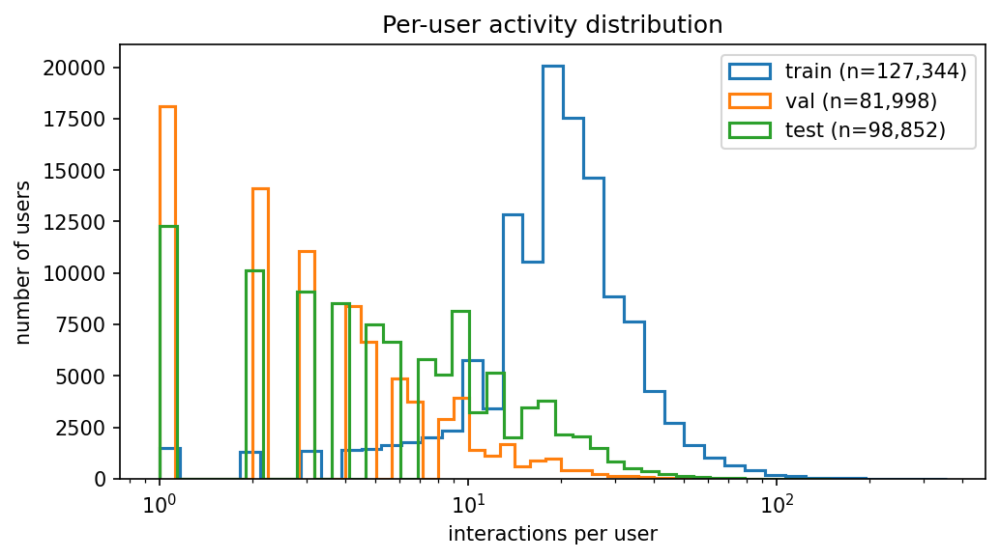
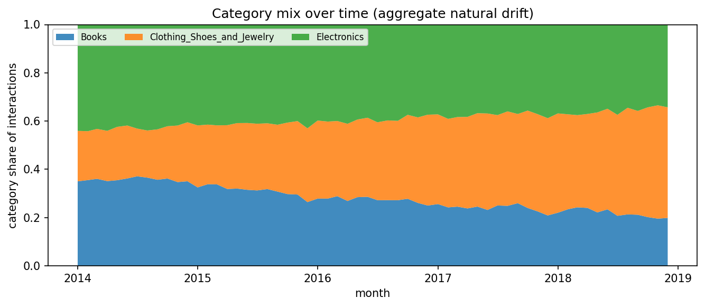
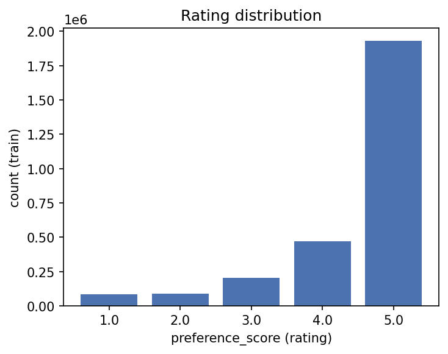

# Run `20260817-220131__phase2-data-validation`

- **Task**: phase2-data-validation
- **Status**: completed
- **Started**: 2026-08-17T22:01:31.972610+00:00
- **Duration**: 8.89 s
- **Git commit**: n/a
- **Seed**: 42
- **Dataset**: amazon-processed

## Objective

Certify the frozen processed splits before any modelling.

## Method

Load train/val/test; compute per-split, cross-split, leakage and drift-ground-truth checks; render diagnostic figures.

## Configuration

```json
{
  "processed_dir": "data/processed",
  "drift_dir": "data/drift"
}
```

## Results

| metric | split | step | value | unit | context |
| --- | --- | --- | --- | --- | --- |
| n_rows | train | 0 | 2780366.0 | rows |  |
| n_users | train | 0 | 127344.0 | users |  |
| n_items | train | 0 | 589045.0 | items |  |
| median_interactions_per_user | train | 0 | 20.0 |  |  |
| n_rows | val | 0 | 397195.0 | rows |  |
| n_users | val | 0 | 81998.0 | users |  |
| n_items | val | 0 | 183070.0 | items |  |
| median_interactions_per_user | val | 0 | 3.0 |  |  |
| n_rows | test | 0 | 794391.0 | rows |  |
| n_users | test | 0 | 98852.0 | users |  |
| n_items | test | 0 | 286622.0 | items |  |
| median_interactions_per_user | test | 0 | 6.0 |  |  |
| test_cold_start_user_rate | test | 0 | 0.034627523975235705 |  |  |
| test_new_item_rate | test | 0 | 0.48605480388804767 |  |  |
| duplicate_rows_across_splits | all | 0 | 0.0 | rows |  |

## Findings

- total interactions: 3,971,952
- split fractions: {'train': 0.6999998992938484, 'val': 0.09999994964692423, 'test': 0.2000001510592273}
- temporal boundaries clean: True
- test cold-start user rate: 3.5%
- drift artifacts usable for training: False
- WARNING: pre-generated test_drifted.parquet is index-inconsistent (item_id changed but item_idx unchanged) — not usable for training; controlled drift must be re-injected at the preference-sequence level

## Limitations

- Validation operates on frozen parquet; ingestion code was not re-run.

## Next steps

- Re-implement controlled drift at the preference-sequence level (Phase 7).
- Build the long/short-term recommender baseline (Phase 3).

## Figures





## Notes

```text
[2026-08-17T22:01:39.224743+00:00] WARNING: pre-generated test_drifted.parquet is index-inconsistent (item_id changed but item_idx unchanged) — not usable for training; controlled drift must be re-injected at the preference-sequence level
```
