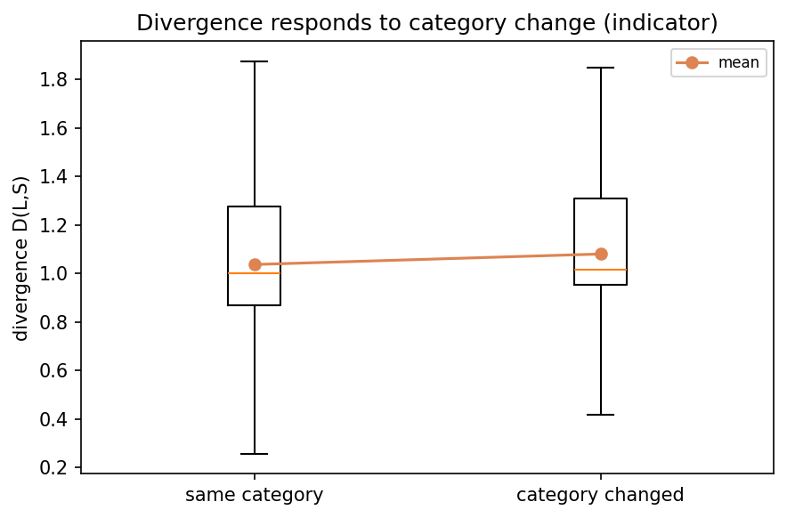
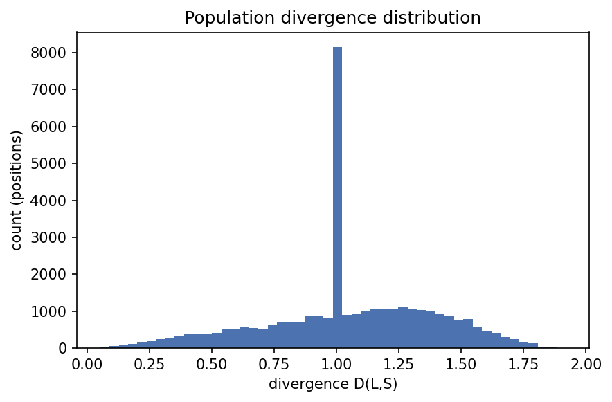
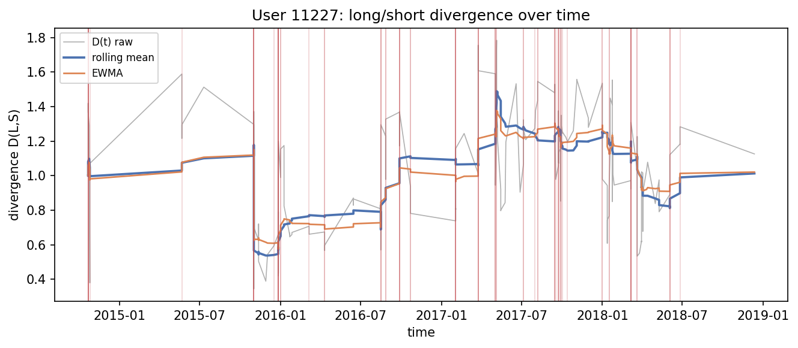
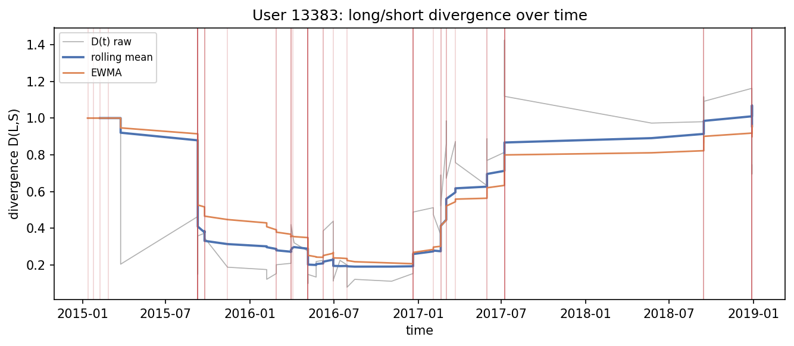
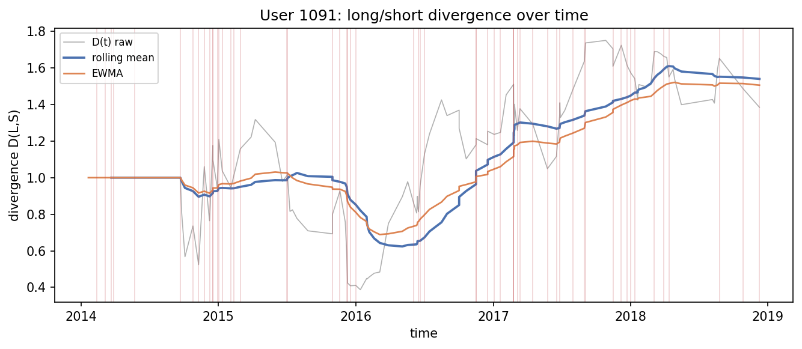
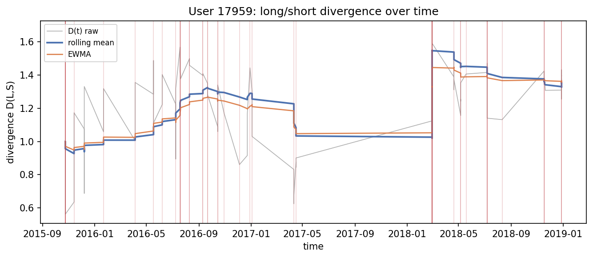
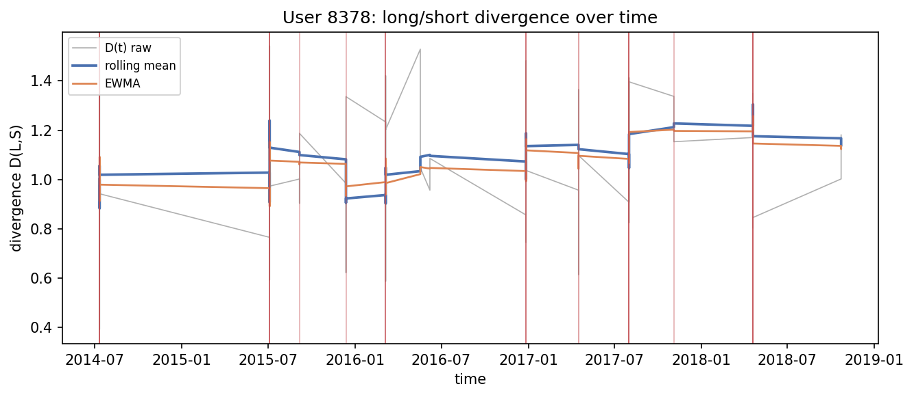
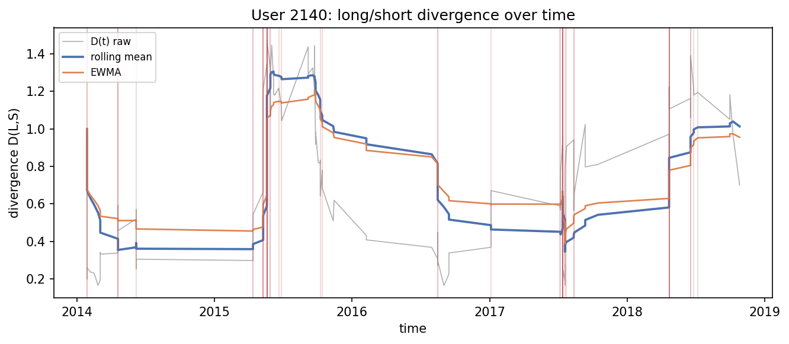

# Run `20260819-044505__phase4-divergence-signal`

- **Task**: phase4-divergence-signal
- **Status**: completed
- **Started**: 2026-08-19T04:45:05.795050+00:00
- **Duration**: 6.34 s
- **Git commit**: 6e9e01efcc76c67c06eabf668425717f6339d149
- **Seed**: 42
- **Dataset**: amazon-subsample

## Objective

Compute D_u(t)=dist(L,S) and validate it responds to shifts.

## Method

cosine divergence over the trained backbone for 800 cohort users; compare divergence at category changes vs stable positions; causal rolling summaries.

## Configuration

```json
{
  "metric": "cosine",
  "max_users": 800,
  "checkpoint": "artifacts/models/baseline-subsample"
}
```

## Results

| metric | split | step | value | unit | context |
| --- | --- | --- | --- | --- | --- |
| users_analyzed | test | 0 | 800.0 | users |  |
| divergence_mean | test | 0 | 1.0482918919306436 |  |  |
| divergence_std | test | 0 | 0.3363122911262156 |  |  |
| divergence_mean_category_changed | test | 0 | 1.0801784247176007 |  |  |
| divergence_mean_category_stable | test | 0 | 1.036797290194149 |  |  |
| positions_total | test | 0 | 35042.0 | positions |  |
| category_change_rate | test | 0 | 0.2649677529821357 |  |  |
| category_change_divergence_lift | test | 0 | 1.0418414813905699 |  |  |

## Findings

- divergence mean=1.0483 std=0.3363 over 35,042 positions
- at category change=1.0802 vs stable=1.0368 (lift x1.04)
- category change is an interpretable indicator, not the drift definition

## Limitations

- Subsample backbone; absolute divergence scale is model-specific.
- Category-change is a coarse proxy for true preference shift.

## Next steps

- Turn persistent rises in D_u(t) into a detector with state model and false-alarm control (Phase 5).

## Figures









