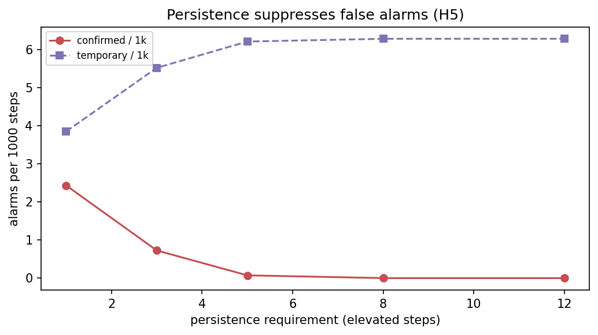
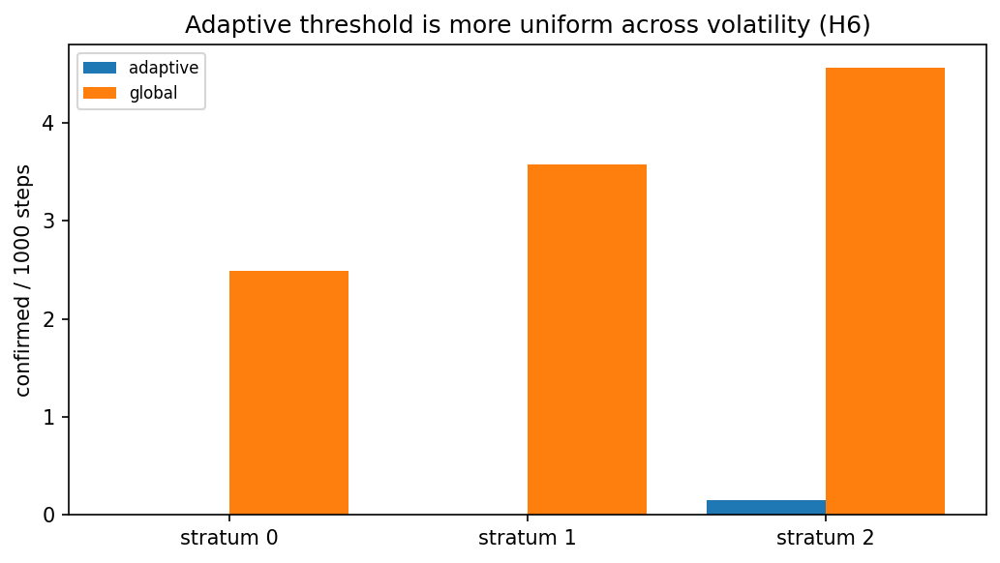
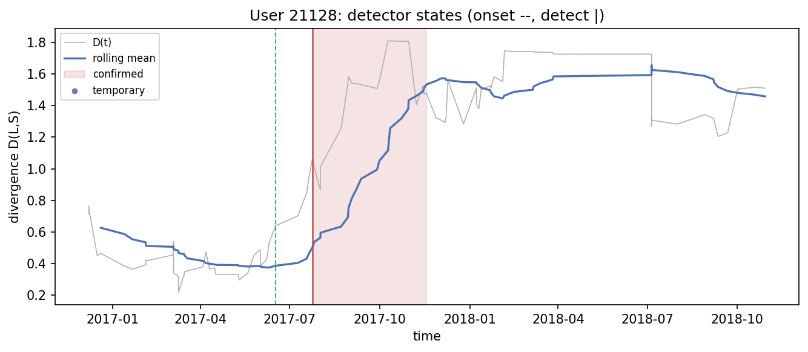
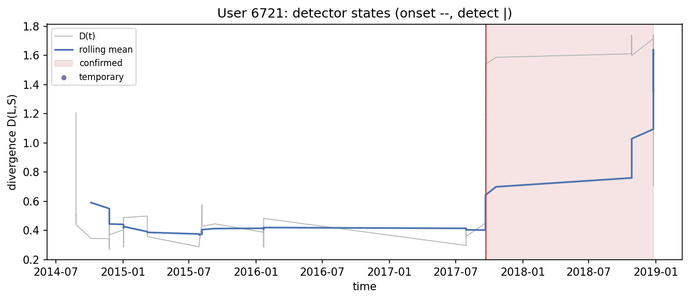
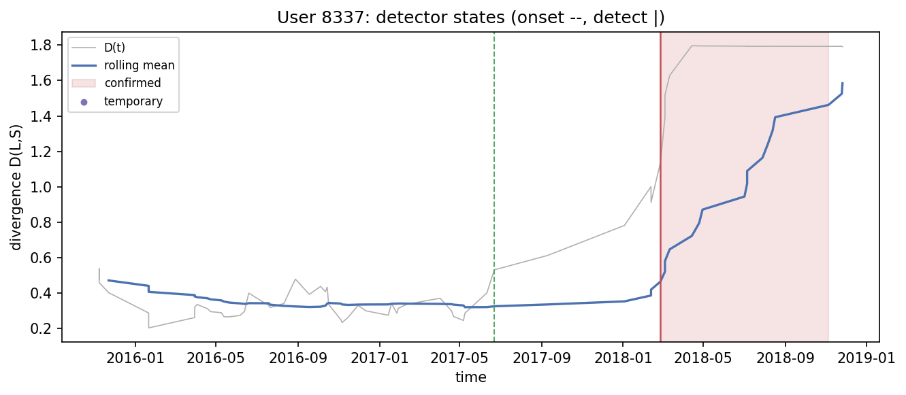

# Run `20260819-050906__phase5-drift-detector`

- **Task**: phase5-drift-detector
- **Status**: completed
- **Started**: 2026-08-19T05:09:06.394120+00:00
- **Duration**: 13.31 s
- **Git commit**: 4fed98ff7898fcacf5c7b6d158e98d7cd32915ba
- **Seed**: 42
- **Dataset**: amazon-subsample

## Objective

Turn a persistent divergence rise into a confirmed-shift detector with false-alarm control, tuned on validation.

## Method

State machine STABLE→EMERGING→CONFIRMED with TEMPORARY suppression; persistence sweep (H5) and adaptive-vs-global by volatility (H6).

## Configuration

```json
{
  "metric": "cosine",
  "persistences": [
    1,
    3,
    5,
    8,
    12
  ]
}
```

## Results

| metric | split | step | value | unit | context |
| --- | --- | --- | --- | --- | --- |
| users_tuned | val | 0 | 849.0 | users |  |
| confirmed_per_1k | val | 1 | 2.4315888800174204 |  | persistence=1 |
| confirmed_per_1k | val | 3 | 0.7258474268708717 |  | persistence=3 |
| confirmed_per_1k | val | 5 | 0.07258474268708717 |  | persistence=5 |
| confirmed_per_1k | val | 8 | 0.0 |  | persistence=8 |
| confirmed_per_1k | val | 12 | 0.0 |  | persistence=12 |
| chosen_confirmed_per_1k | val | 0 | 0.07258474268708717 |  |  |
| chosen_temporary_per_1k | val | 0 | 6.205995499745954 |  |  |
| chosen_users_with_confirm | val | 0 | 0.002355712603062426 |  |  |

## Findings

- persistence 1→5 cuts confirmed alarms 2.4→0.1 per 1k steps (H5)
- adaptive confirmed/1k spread across strata [0.0,0.2] vs global [2.5,4.6] (H6)
- chosen (adaptive, enter=2.5, persistence=5): 0.1 confirmed/1k, 0.2% of users; global enter=1.434
- detector overlays saved for 3 clearest users

## Limitations

- No injected ground truth yet; alarm rate is a false-alarm proxy on natural validation data (Phase 7 adds known onsets).

## Next steps

- Drive α(t) from detector state — adaptive fusion (Phase 6).

## Figures






