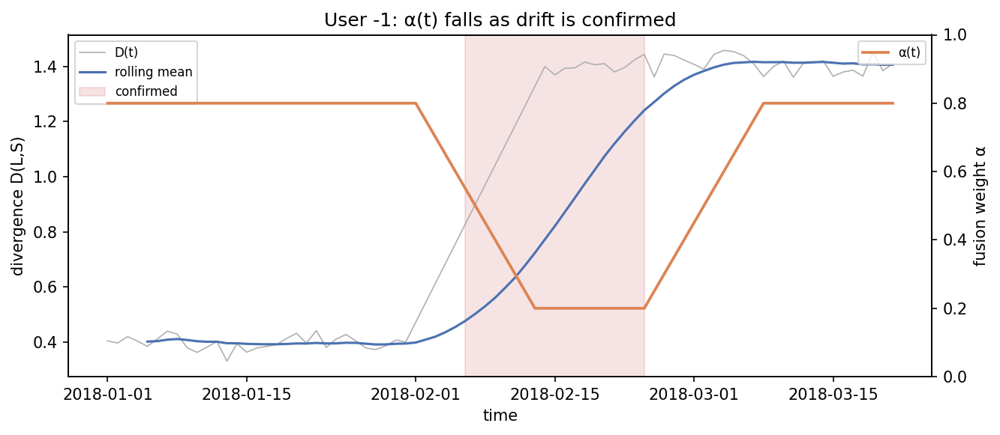
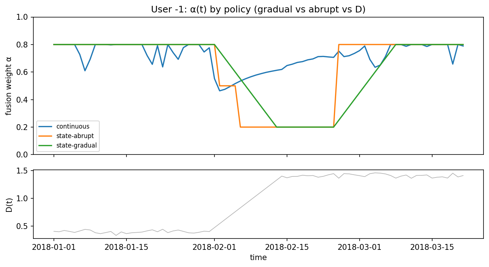

# Run `20260819-052816__phase6-adaptive-fusion`

- **Task**: phase6-adaptive-fusion
- **Status**: completed
- **Started**: 2026-08-19T05:28:16.299908+00:00
- **Duration**: 17.94 s
- **Git commit**: e6f8d93dbc69541678a725339c2b5b88a07cf6b0
- **Seed**: 42
- **Dataset**: amazon-subsample

## Objective

Drive α(t) from detector state and compare against static and detector-free adaptation (mechanism + no regression on natural data).

## Method

Streaming per-user eval over one backbone; α = policy(state, z). Policies: static (A), continuous (D), state abrupt/gradual (proposed).

## Configuration

```json
{
  "top_k": 10,
  "policies": [
    "static-0.5",
    "continuous",
    "state-abrupt",
    "state-gradual"
  ]
}
```

## Results

| metric | split | step | value | unit | context |
| --- | --- | --- | --- | --- | --- |
| users | test | 0 | 671.0 | users |  |
| ndcg_at_k | test | 0 | 0.0026364204757001013 |  | static-0.5 |
| hit_rate_at_k | test | 0 | 0.0054893780534665424 |  | static-0.5 |
| mrr | test | 0 | 0.0023712777855369365 |  | static-0.5 |
| ndcg_at_k_seen | test | 0 | 0.005706032054868569 |  | static-0.5 |
| mean_alpha | test | 0 | 0.5 |  | static-0.5 |
| alpha_changes_per_1k | test | 0 | 0.0 |  | static-0.5 |
| confirmed_frac | test | 0 | 0.0 |  | static-0.5 |
| ndcg_at_k | test | 0 | 0.0027094676390939723 |  | continuous |
| hit_rate_at_k | test | 0 | 0.005928528297743866 |  | continuous |
| mrr | test | 0 | 0.0023159177979368245 |  | continuous |
| ndcg_at_k_seen | test | 0 | 0.005864128784765938 |  | continuous |
| mean_alpha | test | 0 | 0.7500239812143472 |  | continuous |
| alpha_changes_per_1k | test | 0 | 556.677828402042 |  | continuous |
| confirmed_frac | test | 0 | 0.0 |  | continuous |
| ndcg_at_k | test | 0 | 0.0027153731365275515 |  | state-abrupt |
| hit_rate_at_k | test | 0 | 0.005983422078278531 |  | state-abrupt |
| mrr | test | 0 | 0.0023029665675042632 |  | state-abrupt |
| ndcg_at_k_seen | test | 0 | 0.005876910113831817 |  | state-abrupt |
| mean_alpha | test | 0 | 0.7921282318713291 |  | state-abrupt |
| alpha_changes_per_1k | test | 0 | 21.84772465279684 |  | state-abrupt |
| confirmed_frac | test | 0 | 0.0 |  | state-abrupt |
| ndcg_at_k | test | 0 | 0.002714392269395334 |  | state-gradual |
| hit_rate_at_k | test | 0 | 0.005983422078278531 |  | state-gradual |
| mrr | test | 0 | 0.002302344611954347 |  | state-gradual |
| ndcg_at_k_seen | test | 0 | 0.00587478721297075 |  | state-gradual |
| mean_alpha | test | 0 | 0.7965938409178241 |  | state-gradual |
| alpha_changes_per_1k | test | 0 | 49.73376516440687 |  | state-gradual |
| confirmed_frac | test | 0 | 0.0 |  | state-gradual |

## Findings

- NDCG@10 test: static=0.0026 continuous=0.0027 abrupt=0.0027 gradual=0.0027
- adaptation activity (α-changes/1k): static=0.0 continuous=556.7 gradual=49.7
- mean α: static=0.50 gradual=0.80 (gradual lowers α only when drift is confirmed)
- confirmed_frac on test windows=0.0000 (near-zero: short natural test streams rarely confirm)
- synthetic control-law α(t) figures saved (gradual vs abrupt vs continuous)

## Limitations

- Natural test data has few confirmed shifts, so headline metrics are close by design; the benefit is measured under injected drift (Phase 7).
- Static uses α=0.5 while state policies rest near α_stable=0.8, so the natural-data gap reflects α level more than adaptation.

## Next steps

- Inject controlled shifts with known onsets (Phase 7).

## Figures



