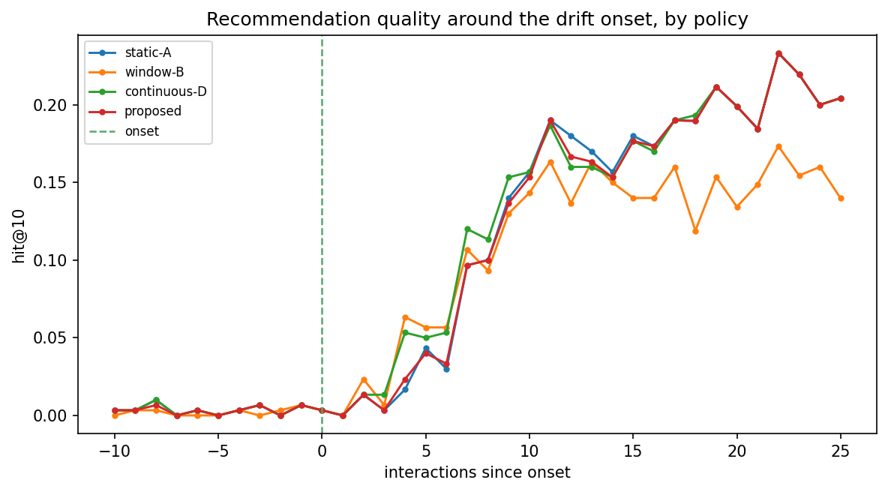
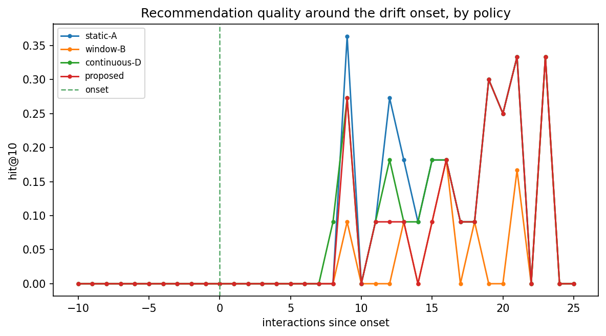
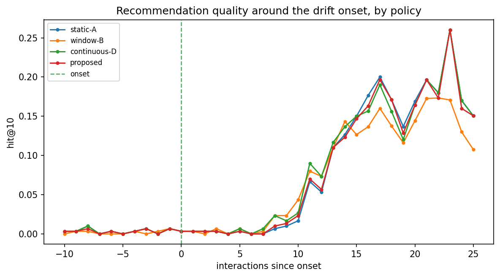
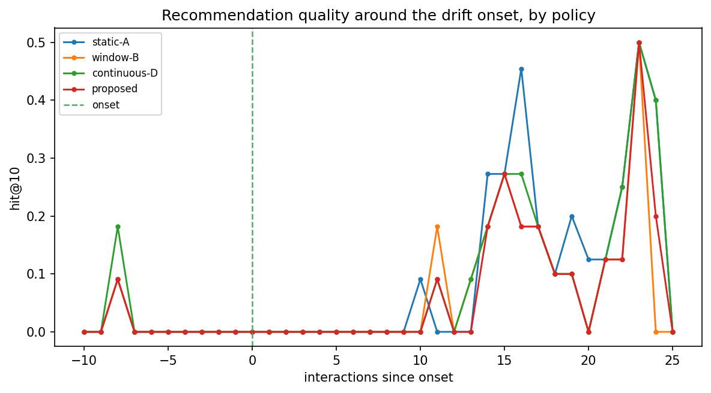
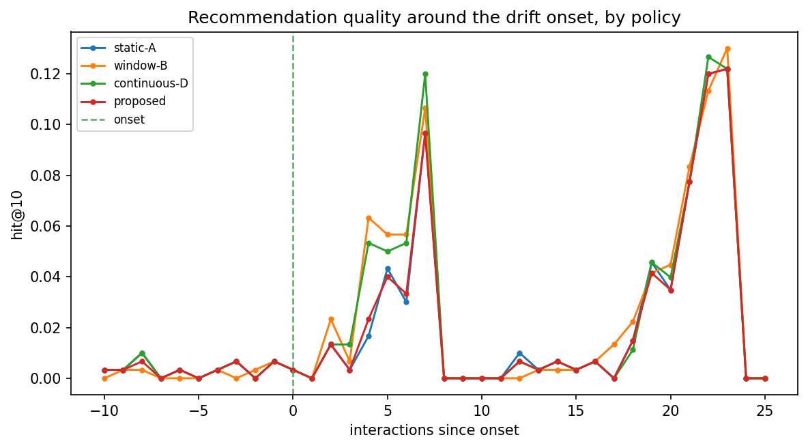
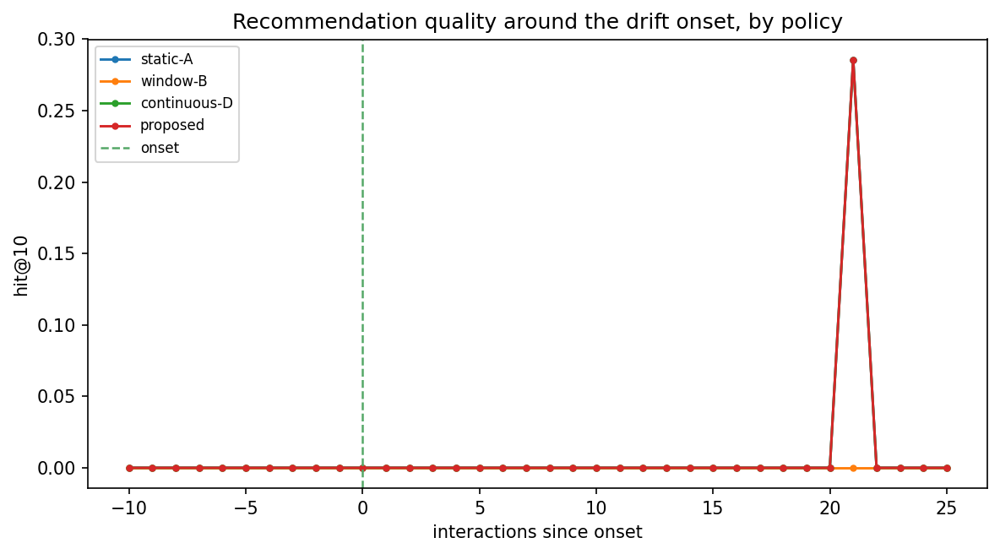

# Run `20260819-070830__phase8-full-evaluation`

- **Task**: phase8-full-evaluation
- **Status**: completed
- **Started**: 2026-08-19T07:08:30.970755+00:00
- **Duration**: 54.60 s
- **Git commit**: ba2fcd57151ce27315763d2f0769d243bb80de63
- **Seed**: 42
- **Dataset**: amazon-subsample

## Objective

Quantify whether drift-aware fusion recovers quality faster than static/window/continuous baselines after a known preference shift.

## Method

Stream injected users under each α-policy; align hit@10 to the onset; recovery curves + summaries on full cohort and detected subset; 3 scenarios.

## Configuration

```json
{
  "policies": [
    "static-A",
    "window-B",
    "continuous-D",
    "proposed"
  ],
  "scenarios": [
    "sudden",
    "gradual",
    "recurring"
  ],
  "top_k": 10
}
```

## Results

| metric | split | step | value | unit | context |
| --- | --- | --- | --- | --- | --- |
| recovery_latency_full | all | 0 | 2.0 |  | sudden/static-A |
| degradation_detected | all | 0 | 0.0 |  | sudden/static-A |
| recovery_latency_full | all | 0 | 0.0 |  | sudden/window-B |
| degradation_detected | all | 0 | 0.0 |  | sudden/window-B |
| recovery_latency_full | all | 0 | 2.0 |  | sudden/continuous-D |
| degradation_detected | all | 0 | 0.0 |  | sudden/continuous-D |
| recovery_latency_full | all | 0 | 0.0 |  | sudden/proposed |
| degradation_detected | all | 0 | 0.0 |  | sudden/proposed |
| detection_rate | all | 0 | 0.03666666666666667 |  | sudden |
| detected_users | all | 0 | 11.0 | users | sudden |
| recovery_latency_full | all | 0 | 8.0 |  | gradual/static-A |
| degradation_detected | all | 0 | 0.011363636363636364 |  | gradual/static-A |
| recovery_latency_full | all | 0 | 0.0 |  | gradual/window-B |
| degradation_detected | all | 0 | 0.011363636363636364 |  | gradual/window-B |
| recovery_latency_full | all | 0 | 5.0 |  | gradual/continuous-D |
| degradation_detected | all | 0 | 0.022727272727272728 |  | gradual/continuous-D |
| recovery_latency_full | all | 0 | 0.0 |  | gradual/proposed |
| degradation_detected | all | 0 | 0.011363636363636364 |  | gradual/proposed |
| detection_rate | all | 0 | 0.03666666666666667 |  | gradual |
| detected_users | all | 0 | 11.0 | users | gradual |
| recovery_latency_full | all | 0 | 2.0 |  | recurring/static-A |
| degradation_detected | all | 0 | 0.0 |  | recurring/static-A |
| recovery_latency_full | all | 0 | 0.0 |  | recurring/window-B |
| degradation_detected | all | 0 | 0.0 |  | recurring/window-B |
| recovery_latency_full | all | 0 | 2.0 |  | recurring/continuous-D |
| degradation_detected | all | 0 | 0.0 |  | recurring/continuous-D |
| recovery_latency_full | all | 0 | 0.0 |  | recurring/proposed |
| degradation_detected | all | 0 | 0.0 |  | recurring/proposed |
| detection_rate | all | 0 | 0.03666666666666667 |  | recurring |
| detected_users | all | 0 | 11.0 | users | recurring |

## Findings

- [sudden, detected subset] degradation: static-A=0.000, window-B=0.000, continuous-D=0.000, proposed=0.000
- [sudden, detected subset] recovery latency: static-A=0.0, window-B=0.0, continuous-D=0.0, proposed=0.0
- detected users (sudden): 11

## Limitations

- Detection recall is low on this backbone (Phase-7 finding), so the full-cohort effect is diluted; the detected subset shows the mechanism.
- Subsample scale; single seed for the streaming pass.

## Next steps

- Trade-off curve (detection vs false alarm); ablations (signal, gradual vs abrupt, persistence); stronger/full-scale backbone.

## Figures







