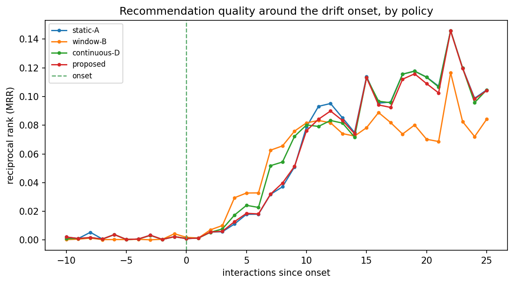
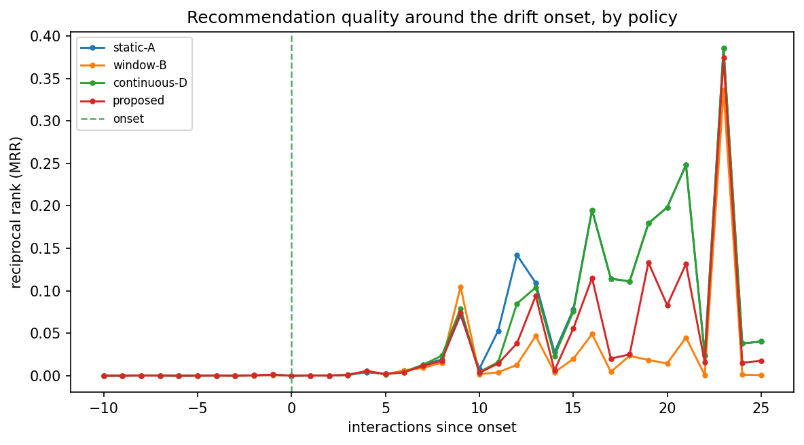
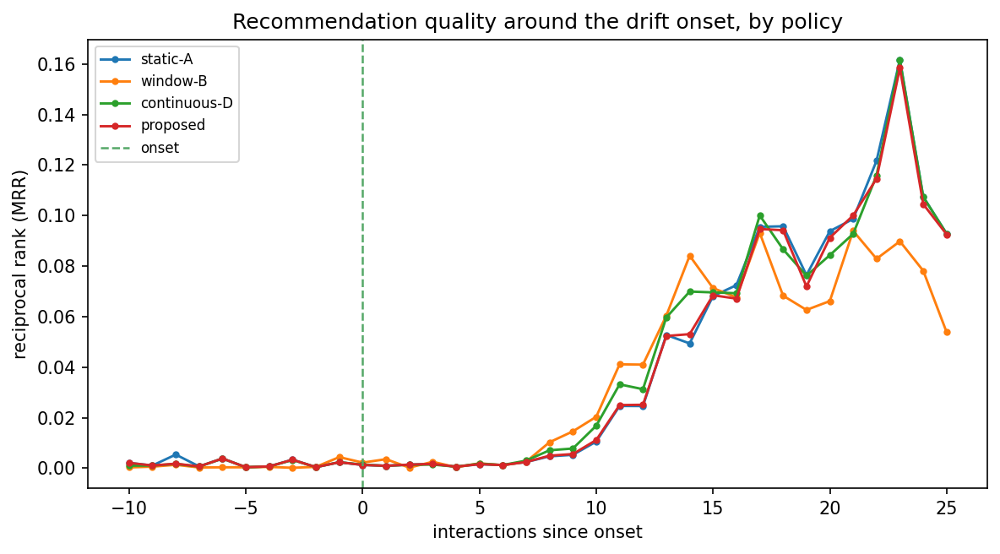
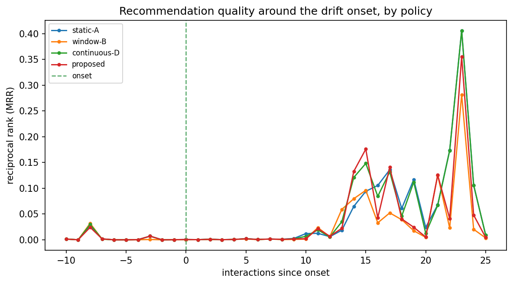
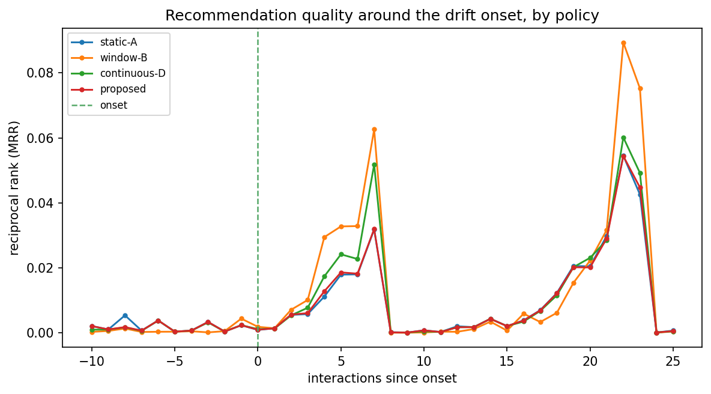
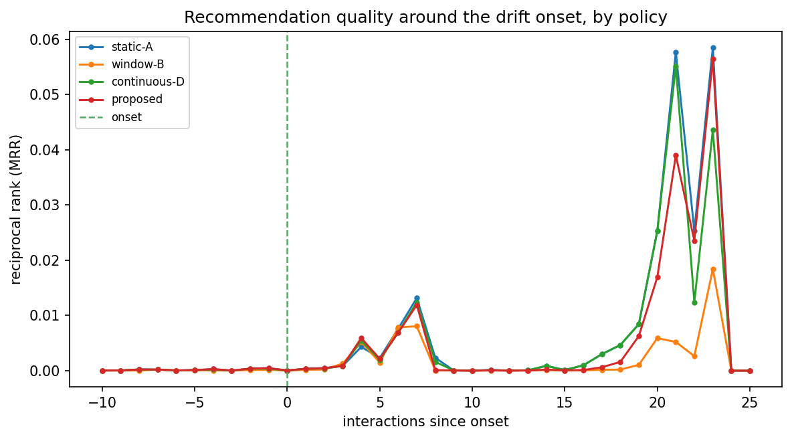
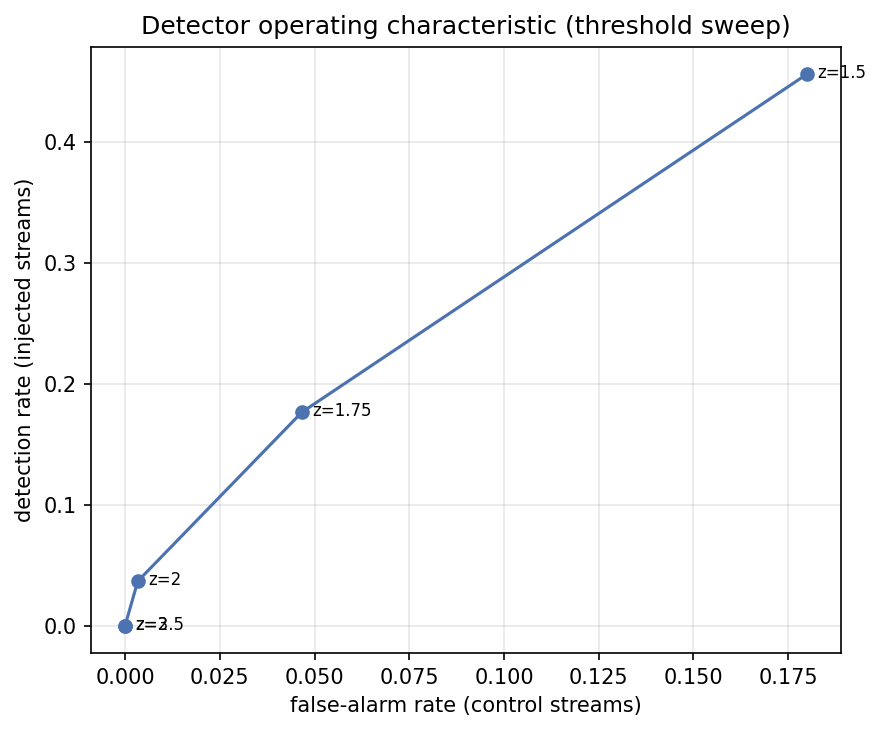

# Run `20260819-071408__phase8-full-evaluation`

- **Task**: phase8-full-evaluation
- **Status**: completed
- **Started**: 2026-08-19T07:14:08.563911+00:00
- **Duration**: 66.07 s
- **Git commit**: ba2fcd57151ce27315763d2f0769d243bb80de63
- **Seed**: 42
- **Dataset**: amazon-subsample

## Objective

Quantify whether drift-aware fusion recovers quality faster than static/window/continuous baselines after a known preference shift.

## Method

Stream injected users under each α-policy; align hit@10 to the onset; recovery curves + summaries on full cohort and detected subset; 3 scenarios.

## Configuration

```json
{
  "policies": [
    "static-A",
    "window-B",
    "continuous-D",
    "proposed"
  ],
  "scenarios": [
    "sudden",
    "gradual",
    "recurring"
  ],
  "top_k": 10
}
```

## Results

| metric | split | step | value | unit | context |
| --- | --- | --- | --- | --- | --- |
| recovery_latency_full | all | 0 | 2.0 |  | sudden/static-A |
| degradation_detected | all | 0 | 0.0003190034584841969 |  | sudden/static-A |
| recovery_latency_full | all | 0 | 0.0 |  | sudden/window-B |
| degradation_detected | all | 0 | 0.0001709270505900635 |  | sudden/window-B |
| recovery_latency_full | all | 0 | 2.0 |  | sudden/continuous-D |
| degradation_detected | all | 0 | 0.00029253919477271236 |  | sudden/continuous-D |
| recovery_latency_full | all | 0 | 2.0 |  | sudden/proposed |
| degradation_detected | all | 0 | 0.0003192447217085379 |  | sudden/proposed |
| detection_rate | all | 0 | 0.03666666666666667 |  | sudden |
| detected_users | all | 0 | 11.0 | users | sudden |
| recovery_latency_full | all | 0 | 7.0 |  | gradual/static-A |
| degradation_detected | all | 0 | 0.004284437670969897 |  | gradual/static-A |
| recovery_latency_full | all | 0 | 0.0 |  | gradual/window-B |
| degradation_detected | all | 0 | 0.004174433484581904 |  | gradual/window-B |
| recovery_latency_full | all | 0 | 5.0 |  | gradual/continuous-D |
| degradation_detected | all | 0 | 0.004617659388024317 |  | gradual/continuous-D |
| recovery_latency_full | all | 0 | 3.0 |  | gradual/proposed |
| degradation_detected | all | 0 | 0.003977209254643105 |  | gradual/proposed |
| detection_rate | all | 0 | 0.03666666666666667 |  | gradual |
| detected_users | all | 0 | 11.0 | users | gradual |
| recovery_latency_full | all | 0 | 2.0 |  | recurring/static-A |
| degradation_detected | all | 0 | 0.00021736672940624033 |  | recurring/static-A |
| recovery_latency_full | all | 0 | 0.0 |  | recurring/window-B |
| degradation_detected | all | 0 | 8.472632294449958e-05 |  | recurring/window-B |
| recovery_latency_full | all | 0 | 2.0 |  | recurring/continuous-D |
| degradation_detected | all | 0 | 0.00019039651576283732 |  | recurring/continuous-D |
| recovery_latency_full | all | 0 | 2.0 |  | recurring/proposed |
| degradation_detected | all | 0 | 0.00021742257073533857 |  | recurring/proposed |
| detection_rate | all | 0 | 0.03666666666666667 |  | recurring |
| detected_users | all | 0 | 11.0 | users | recurring |
| detection_rate | all | 150 | 0.45666666666666667 |  | tradeoff/enter=1.5 |
| false_alarm_rate | all | 150 | 0.18 |  | tradeoff/enter=1.5 |
| detection_rate | all | 175 | 0.17666666666666667 |  | tradeoff/enter=1.75 |
| false_alarm_rate | all | 175 | 0.04666666666666667 |  | tradeoff/enter=1.75 |
| detection_rate | all | 200 | 0.03666666666666667 |  | tradeoff/enter=2.0 |
| false_alarm_rate | all | 200 | 0.0033333333333333335 |  | tradeoff/enter=2.0 |
| detection_rate | all | 250 | 0.0 |  | tradeoff/enter=2.5 |
| false_alarm_rate | all | 250 | 0.0 |  | tradeoff/enter=2.5 |
| detection_rate | all | 300 | 0.0 |  | tradeoff/enter=3.0 |
| false_alarm_rate | all | 300 | 0.0 |  | tradeoff/enter=3.0 |

## Findings

- [sudden, detected subset] degradation: static-A=0.000, window-B=0.000, continuous-D=0.000, proposed=0.000
- [sudden, detected subset] recovery latency: static-A=1.0, window-B=2.0, continuous-D=3.0, proposed=1.0
- detected users (sudden): 11

## Limitations

- Detection recall is low on this backbone (Phase-7 finding), so the full-cohort effect is diluted; the detected subset shows the mechanism.
- Subsample scale; single seed for the streaming pass.

## Next steps

- Trade-off curve (detection vs false alarm); ablations (signal, gradual vs abrupt, persistence); stronger/full-scale backbone.

## Figures








