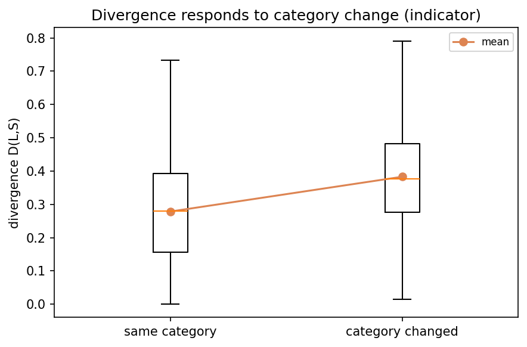
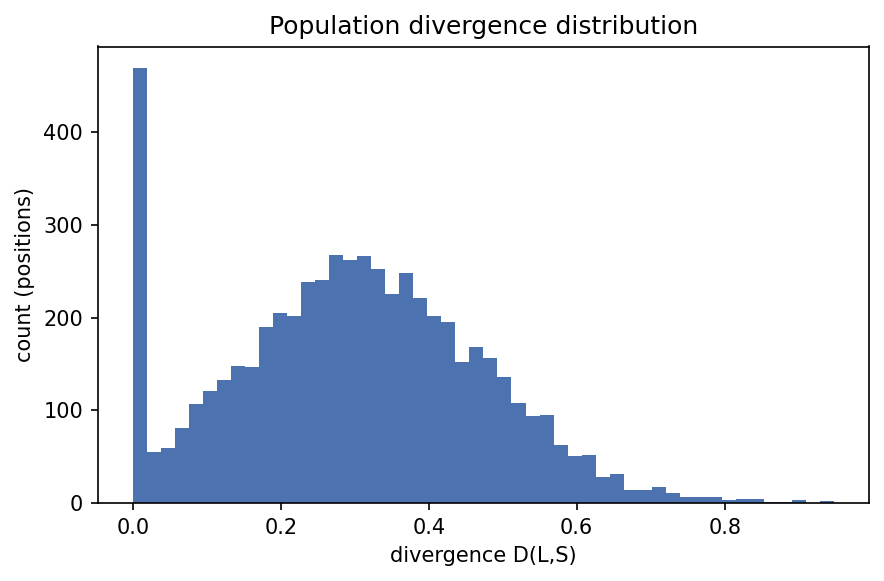
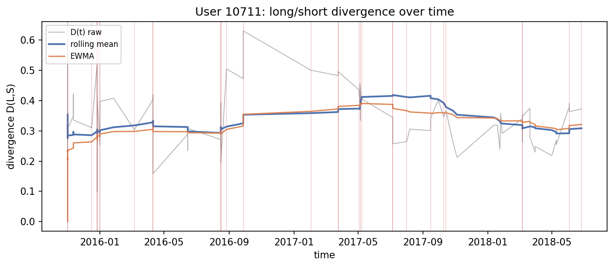
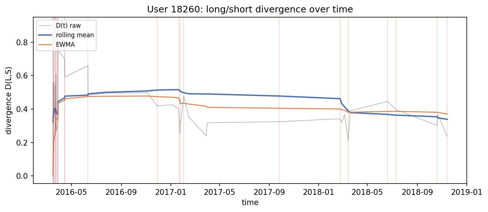
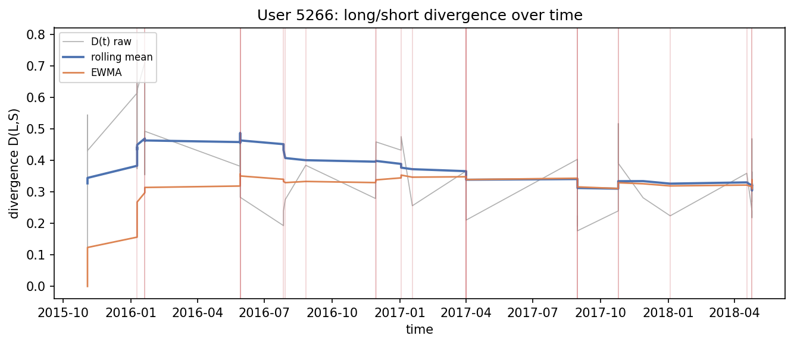
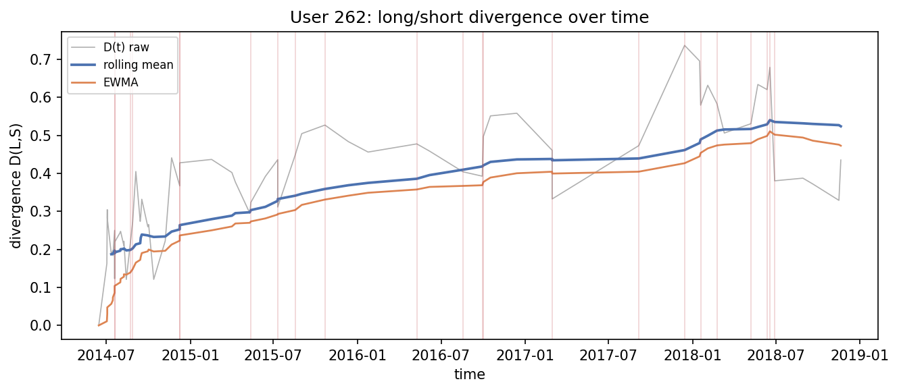
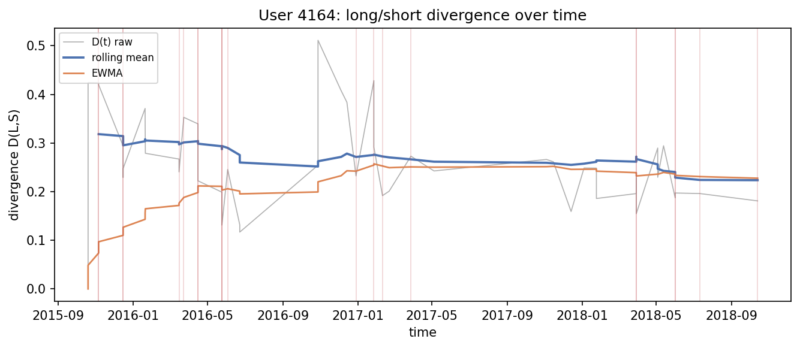
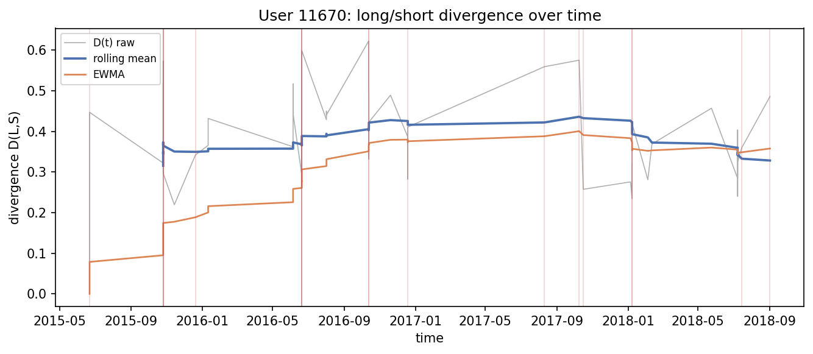

# Run `20260825-163539__phase4-divergence-signal`

- **Task**: phase4-divergence-signal
- **Status**: completed
- **Started**: 2026-08-25T16:35:39.381623+00:00
- **Duration**: 5.07 s
- **Git commit**: 7e600cc39b00d3921248d4443656d9381154576b
- **Seed**: 42
- **Dataset**: amazon-subsample

## Objective

Compute D_u(t)=dist(L,S) and validate it responds to shifts.

## Method

short_term_drift drift signal over the trained backbone for 452 cohort users; compare divergence at category changes vs stable positions; causal rolling summaries.

## Configuration

```json
{
  "signal": "short_term_drift",
  "max_users": 600,
  "checkpoint": "artifacts/models/baseline-subsample"
}
```

## Results

| metric | split | step | value | unit | context |
| --- | --- | --- | --- | --- | --- |
| users_analyzed | test | 0 | 452.0 | users |  |
| divergence_mean | test | 0 | 0.29965792317439655 |  |  |
| divergence_std | test | 0 | 0.17070338819338593 |  |  |
| divergence_mean_category_changed | test | 0 | 0.38297961525222773 |  |  |
| divergence_mean_category_stable | test | 0 | 0.2784421713286811 |  |  |
| positions_total | test | 0 | 5765.0 | positions |  |
| category_change_rate | test | 0 | 0.20294882914137033 |  |  |
| category_change_divergence_lift | test | 0 | 1.375436822032779 |  |  |

## Findings

- divergence mean=0.2997 std=0.1707 over 5,765 positions
- at category change=0.3830 vs stable=0.2784 (lift x1.38)
- category change is an interpretable indicator, not the definition

## Limitations

- Subsample backbone; absolute divergence scale is model-specific.
- Category-change is a coarse proxy for true preference shift.

## Next steps

- Turn persistent rises in D_u(t) into a detector with state model and false-alarm control (Phase 5).

## Figures









