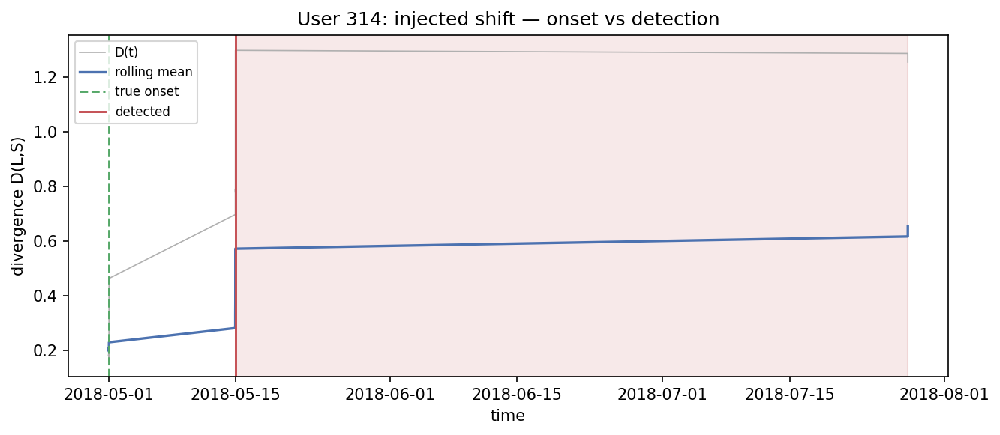
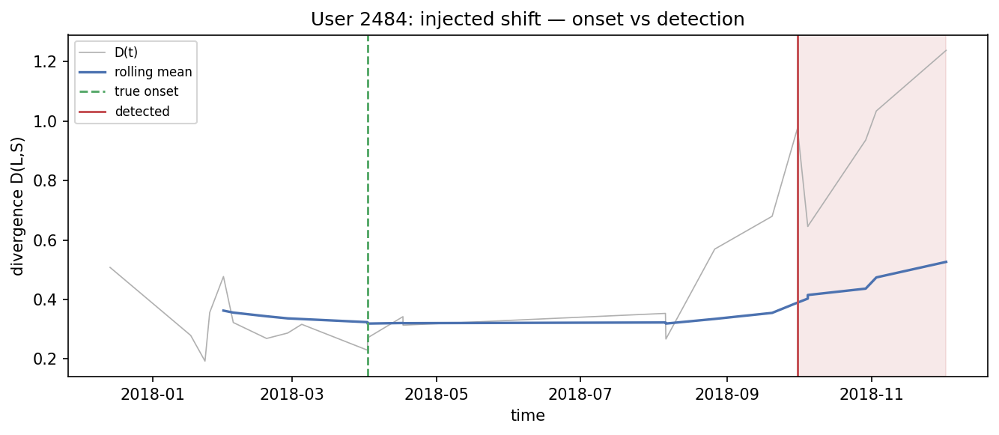
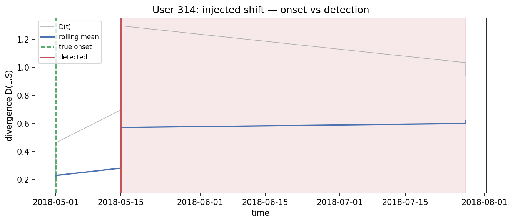

# Run `20260825-163719__phase7-inject-drift`

- **Task**: phase7-inject-drift
- **Status**: completed
- **Started**: 2026-08-25T16:37:19.141448+00:00
- **Duration**: 5.05 s
- **Git commit**: 7e600cc39b00d3921248d4443656d9381154576b
- **Seed**: 42
- **Dataset**: amazon-subsample

## Objective

Create reproducible preference-sequence shifts with known onsets and confirm they are detectable, replacing the broken drifted parquet.

## Method

Switch post-onset items to a cluster whose short-term rep is most opposed to the user's established profile; sudden/gradual/recurring; stream injected vs control and measure detection latency and false alarms.

## Configuration

```json
{
  "n_users": 300,
  "types": [
    "sudden",
    "gradual",
    "recurring"
  ]
}
```

## Results

| metric | split | step | value | unit | context |
| --- | --- | --- | --- | --- | --- |
| injected_users | all | 0 | 83.0 | users | sudden |
| detection_rate | all | 0 | 0.3855421686746988 |  | sudden |
| false_alarm_rate | all | 0 | 0.012048192771084338 |  | sudden |
| median_detection_latency | all | 0 | 3.0 | interactions | sudden |
| injected_users | all | 0 | 83.0 | users | gradual |
| detection_rate | all | 0 | 0.18072289156626506 |  | gradual |
| false_alarm_rate | all | 0 | 0.012048192771084338 |  | gradual |
| median_detection_latency | all | 0 | 7.0 | interactions | gradual |
| injected_users | all | 0 | 83.0 | users | recurring |
| detection_rate | all | 0 | 0.3855421686746988 |  | recurring |
| false_alarm_rate | all | 0 | 0.012048192771084338 |  | recurring |
| median_detection_latency | all | 0 | 3.0 | interactions | recurring |

## Findings

- sudden: detection_rate=0.39, median_latency=3, false_alarm=1/83
- gradual: detection_rate=0.18, median_latency=7, false_alarm=1/83
- recurring: detection_rate=0.39, median_latency=3, false_alarm=1/83
- injected splits + onset ground truth saved under data/interim/subsample/

## Limitations

- Strong, clean synthetic shifts (anti-profile cluster); real drift is weaker/messier. Detection is bounded by the subsample backbone.
- Sanity uses static α; full latency/recovery comparison is Phase 8.

## Next steps

- Phase 8: control vs injected, all policies; detect/adapt/recover.

## Figures




