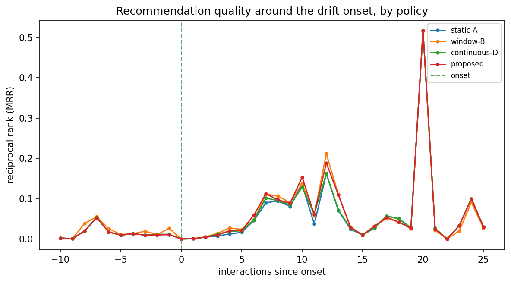
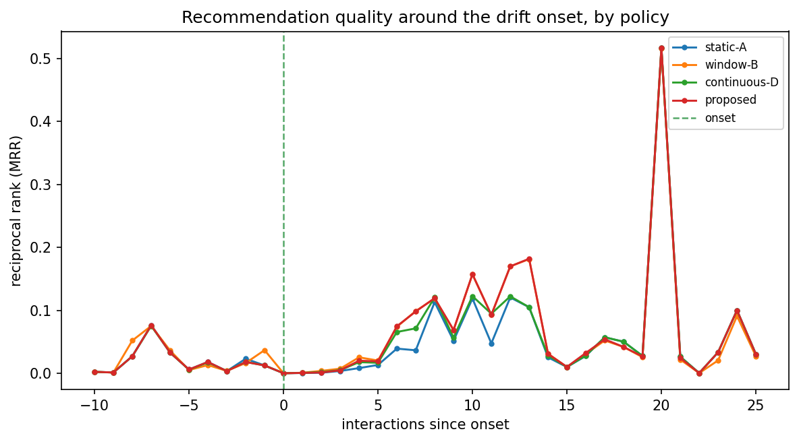
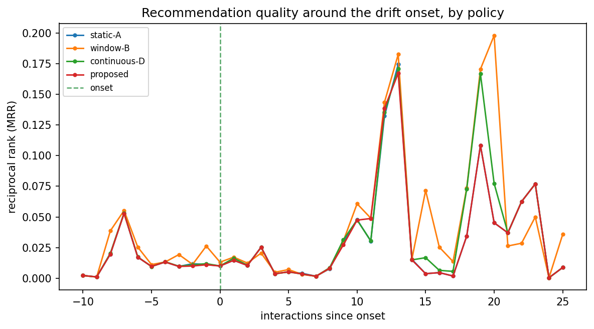
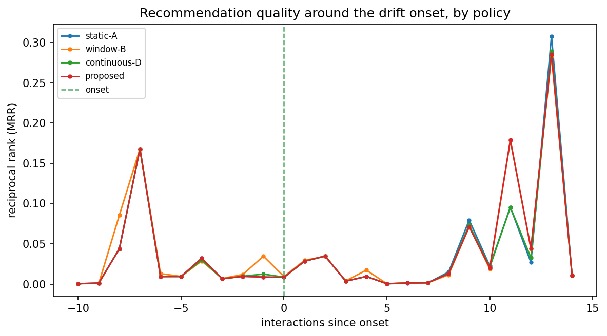
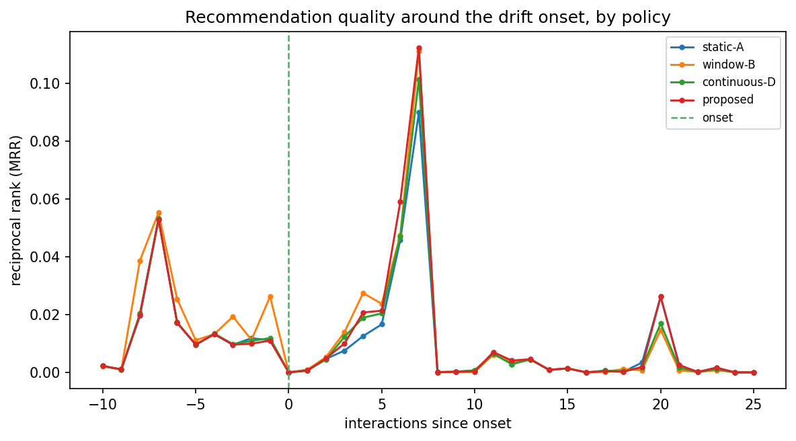
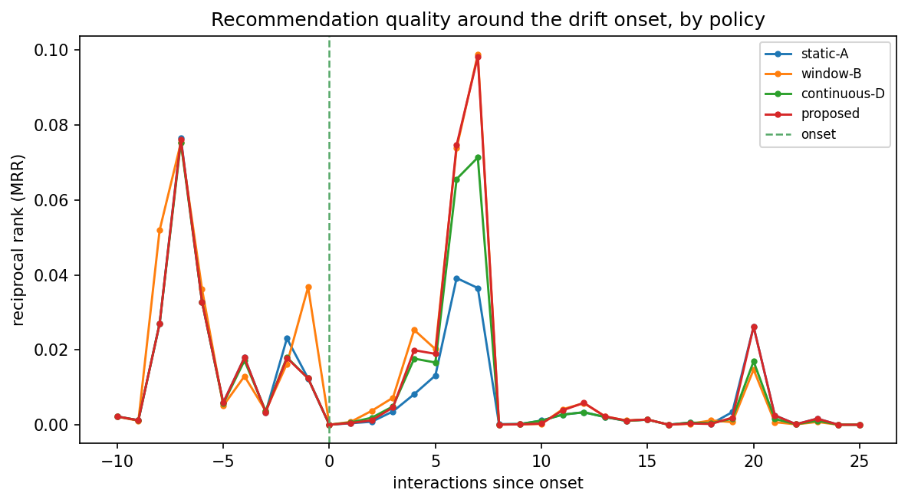
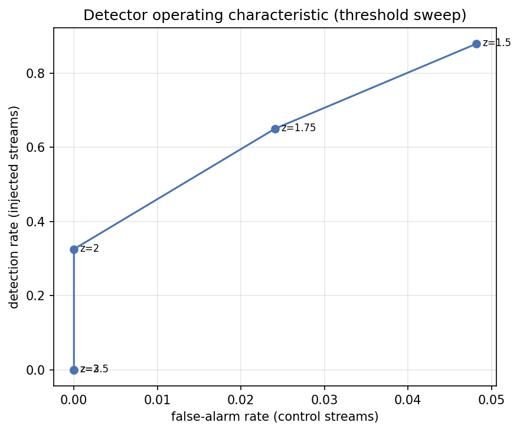

# Run `20260825-163750__phase8-full-evaluation`

- **Task**: phase8-full-evaluation
- **Status**: completed
- **Started**: 2026-08-25T16:37:50.384934+00:00
- **Duration**: 11.06 s
- **Git commit**: 7e600cc39b00d3921248d4443656d9381154576b
- **Seed**: 42
- **Dataset**: amazon-subsample

## Objective

Quantify whether drift-aware fusion recovers quality faster than static/window/continuous baselines after a known preference shift.

## Method

Stream injected users under each α-policy; align hit@10 to the onset; recovery curves + summaries on full cohort and detected subset; 3 scenarios.

## Configuration

```json
{
  "policies": [
    "static-A",
    "window-B",
    "continuous-D",
    "proposed"
  ],
  "scenarios": [
    "sudden",
    "gradual",
    "recurring"
  ],
  "top_k": 10
}
```

## Results

| metric | split | step | value | unit | context |
| --- | --- | --- | --- | --- | --- |
| recovery_latency_full | all | 0 | 5.0 |  | sudden/static-A |
| degradation_detected | all | 0 | 0.024816199901268106 |  | sudden/static-A |
| recovery_latency_full | all | 0 | 4.0 |  | sudden/window-B |
| degradation_detected | all | 0 | 0.029707374141987528 |  | sudden/window-B |
| recovery_latency_full | all | 0 | 4.0 |  | sudden/continuous-D |
| degradation_detected | all | 0 | 0.023961788125459915 |  | sudden/continuous-D |
| recovery_latency_full | all | 0 | 4.0 |  | sudden/proposed |
| degradation_detected | all | 0 | 0.024129128983387125 |  | sudden/proposed |
| detection_rate | all | 0 | 0.3855421686746988 |  | sudden |
| detected_users | all | 0 | 32.0 | users | sudden |
| recovery_latency_full | all | 0 | 3.0 |  | gradual/static-A |
| degradation_detected | all | 0 | 0.03549239461717016 |  | gradual/static-A |
| recovery_latency_full | all | 0 | 9.0 |  | gradual/window-B |
| degradation_detected | all | 0 | 0.04429559862557131 |  | gradual/window-B |
| recovery_latency_full | all | 0 | 3.0 |  | gradual/continuous-D |
| degradation_detected | all | 0 | 0.035662592105858 |  | gradual/continuous-D |
| recovery_latency_full | all | 0 | 3.0 |  | gradual/proposed |
| degradation_detected | all | 0 | 0.03547883380040358 |  | gradual/proposed |
| detection_rate | all | 0 | 0.18072289156626506 |  | gradual |
| detected_users | all | 0 | 15.0 | users | gradual |
| recovery_latency_full | all | 0 | 5.0 |  | recurring/static-A |
| degradation_detected | all | 0 | 0.02482014349702269 |  | recurring/static-A |
| recovery_latency_full | all | 0 | 4.0 |  | recurring/window-B |
| degradation_detected | all | 0 | 0.029712245901342547 |  | recurring/window-B |
| recovery_latency_full | all | 0 | 4.0 |  | recurring/continuous-D |
| degradation_detected | all | 0 | 0.023964380466669426 |  | recurring/continuous-D |
| recovery_latency_full | all | 0 | 4.0 |  | recurring/proposed |
| degradation_detected | all | 0 | 0.024133335948994396 |  | recurring/proposed |
| detection_rate | all | 0 | 0.3855421686746988 |  | recurring |
| detected_users | all | 0 | 32.0 | users | recurring |
| detection_rate | all | 150 | 0.8795180722891566 |  | tradeoff/enter=1.5 |
| false_alarm_rate | all | 150 | 0.04819277108433735 |  | tradeoff/enter=1.5 |
| detection_rate | all | 175 | 0.6506024096385542 |  | tradeoff/enter=1.75 |
| false_alarm_rate | all | 175 | 0.024096385542168676 |  | tradeoff/enter=1.75 |
| detection_rate | all | 200 | 0.3253012048192771 |  | tradeoff/enter=2.0 |
| false_alarm_rate | all | 200 | 0.0 |  | tradeoff/enter=2.0 |
| detection_rate | all | 250 | 0.0 |  | tradeoff/enter=2.5 |
| false_alarm_rate | all | 250 | 0.0 |  | tradeoff/enter=2.5 |
| detection_rate | all | 300 | 0.0 |  | tradeoff/enter=3.0 |
| false_alarm_rate | all | 300 | 0.0 |  | tradeoff/enter=3.0 |

## Findings

- [sudden, detected subset] degradation: static-A=0.025, window-B=0.030, continuous-D=0.024, proposed=0.024
- [sudden, detected subset] recovery latency: static-A=6.0, window-B=6.0, continuous-D=6.0, proposed=6.0
- detected users (sudden): 32

## Limitations

- Detection recall is low on this backbone (Phase-7 finding), so the full-cohort effect is diluted; the detected subset shows the mechanism.
- Subsample scale; single seed for the streaming pass.

## Next steps

- Trade-off curve (detection vs false alarm); ablations (signal, gradual vs abrupt, persistence); stronger/full-scale backbone.

## Figures








