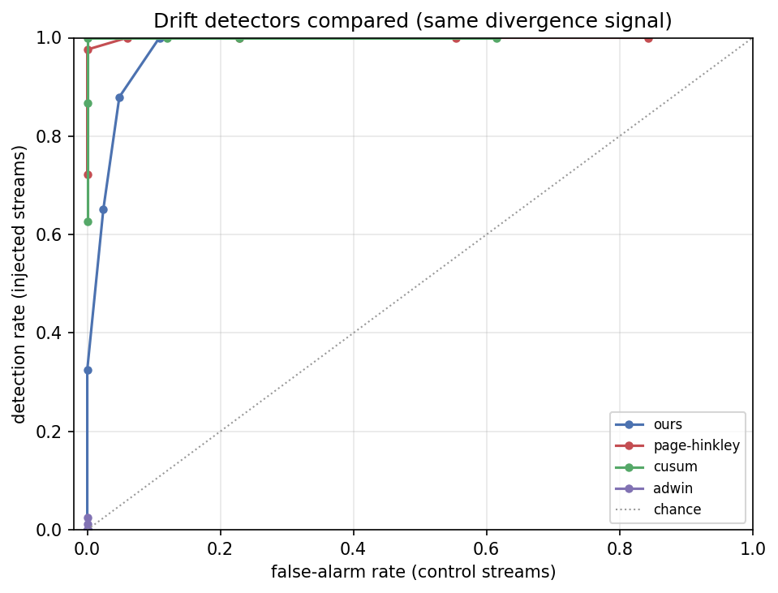

# Run `20260826-094126__p1-1-baseline-detectors`

- **Task**: p1-1-baseline-detectors
- **Status**: completed
- **Started**: 2026-08-26T09:41:26.518760+00:00
- **Duration**: 2.13 s
- **Git commit**: bc10e70ee4bd9712c8918407c3008c352d8bc0c4
- **Seed**: 42
- **Dataset**: amazon-subsample

## Objective

Compare our persistence-aware detector against the classical concept-drift literature (Page-Hinkley, CUSUM, ADWIN) on the same signal.

## Method

Sweep each detector's sensitivity knob over 83 injected and 83 control divergence series; trace detection vs false-alarm.

## Configuration

```json
{
  "n_users": 300,
  "detectors": [
    "ours",
    "page-hinkley",
    "cusum",
    "adwin"
  ]
}
```

## Results

_No metric recorded._

## Findings

- ours: best detection 0.88 @ false-alarm 0.048 (knob=1.5, target FA<=0.05)
- page-hinkley: best detection 0.98 @ false-alarm 0.000 (knob=2, target FA<=0.05)
- cusum: best detection 1.00 @ false-alarm 0.000 (knob=1, target FA<=0.05)
- adwin: best detection 0.02 @ false-alarm 0.000 (knob=0.5, target FA<=0.05)

## Limitations

- Single injection seed; sudden scenario. DDM/EDDM excluded (they monitor classifier error, not a continuous divergence).
- Baselines consume the raw divergence; ours adds a causal per-user z-score and persistence — that pipeline difference is exactly what is compared.

## Next steps

- Sequential-recommender baselines (RecBole GRU4Rec/SASRec).

## Figures


