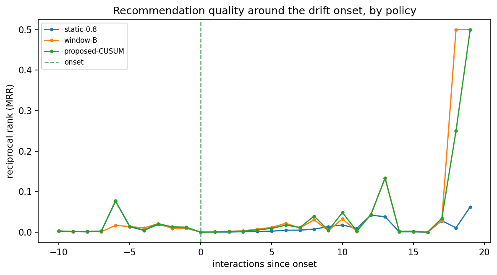

# Run `20260826-221237__dense-adaptation-cusum`

- **Task**: dense-adaptation-cusum
- **Status**: completed
- **Started**: 2026-08-26T22:12:37.854549+00:00
- **Duration**: 7.13 s
- **Git commit**: eef23efcbb2299047fdb33847543cc795cca5a2d
- **Seed**: 42
- **Dataset**: amazon-subsample-dense

## Objective

Test whether CUSUM-driven adaptive fusion beats static-α=0.8 and window-B on the dense cohort where long-term memory helps.

## Method

Off-the-shelf CUSUM (enter=0.5, calibrated to ≤0.1 control false-alarm) drives α (STABLE 0.8 → CONFIRMED 0.2, gradual); compare pre/post/overall NDCG@10 against static-0.8 and window-B on a sudden shift.

## Configuration

```json
{
  "top_k": 10,
  "stable_alpha": 0.8,
  "mechanism": "coherent",
  "long_term_mode": "attention",
  "n_injected": 102
}
```

## Results

| metric | split | step | value | unit | context |
| --- | --- | --- | --- | --- | --- |
| cusum_enter | all | 0 | 0.5 |  | calibrated |
| recovery_latency | all | 0 | 10.0 |  | static-0.8 |
| recovery_latency | all | 0 | 5.0 |  | window-B |
| recovery_latency | all | 0 | 6.0 |  | proposed-CUSUM |

## Findings

- NO WIN: proposed 0.01052 vs static-0.8 0.00524, window-B 0.01087 — adaptation does not dominate.
- static-0.8: pre=0.01346 post=0.00040 overall=0.00524
- window-B: pre=0.01472 post=0.00861 overall=0.01087
- proposed-CUSUM: pre=0.01672 post=0.00688 overall=0.01052

## Limitations

- Dense cohort is small; single seed; sudden scenario only.
- Short test streams limit post-onset resolution; overall pooled NDCG is the robust headline.

## Next steps

- Seed/CI repetition; gradual & recurring scenarios; full-scale backbone.

## Figures


